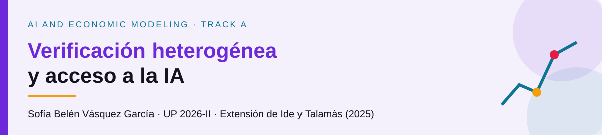

**Sofía Belén Vásquez García · Track A · AI and Economic Modeling · UP 2026-II.**

**Pregunta.** ¿Puede un costo de validación decreciente con el conocimiento desplazar el uso directo de IA no autónoma desde la base hacia tipos intermedios? Extensión propia de Ide y Talamàs (2025), **Proposición 6, p. 27 de arXiv v11**. No atribuye un error al paper.

**Modelo.** Humanos de masa uno, tipos observables $z\in[0,1]$, distribución $G$ con densidad positiva y continua, problemas uniformes, dos niveles, competencia y libre entrada. Se mantienen $0<h<h_0(G)$, $a\in(0,1)$ e IA solo asesora. Con $\mu>h$, el cómputo es ocioso y $r=0$. El gasto real $c(z)\geq0$, $c'(z)\leq0$, es por trabajador y período; no consume tiempo ni cambia éxito. Inicialmente $c(z)=\kappa(1-z)$, $\kappa\geq0$.

$$\max_{0\leq z\leq a}\Pi^V(z)=n(z)[a-w^V(z)-c(z)]-r,\qquad n(z)=\frac1{h(1-z)}.$$

**Resultado esperado y alcance.** En un óptimo interior diferenciable, la FOC es $w^{V\prime}+c'=(a-w^V-c)/(1-z)$. **Además**, beneficio cero en actividades usadas implica que ese cociente es $hr$. Con $r=0$, $w^V=a-c$ entre usuarios, y $w^{V\prime}=\kappa$ en un intervalo activo diferenciable. La FOC no determina quién usa IA. La **conjetura** es selección intermedia para algunos parámetros; $\kappa>w^{0\prime}$ solo hace crecer localmente la ventaja de entrada $\Delta^0=a-c-w^0$. El ejemplo $G(z)=z,h=.5,a=.88,\kappa=.53$ reproduce $(-.0070,+.0081,-.0232)$ en $z=(0,.25,.60)$: **entrada a salarios iniciales, no equilibrio**. Se comparará costo constante vs. pendiente y se recuperará el baseline al cerrar el modelo con $c=0$.

| Entregable | Estado |
|---|---|
| [Propuesta](proposal/proposal.pdf) y [topic](slides/topic.pdf), con `.tex` | ✅ Topic listo; 7-oct, 07:55 |
| [Código](code/verify.py), CSV y figura | ✅ SymPy y ejemplo; equilibrio nuevo pendiente |
| [Slides finales](slides/final.tex) | ⏳ 28-oct; plantilla pendiente |
| [Paper](paper/paper.tex) | ⏳ 26-nov; plantilla pendiente, ejemplo ajeno al topic |
| [Lean](lean/) | ⏳ AppliedModelingLib; sin formalización propia aún |
| [Manuscritos](hand/README.md) y [prompts](prompts.md) | Lista de derivaciones; fotos pendientes / registro disponible |

**Reproducir:** `python3 -m pip install -r code/requirements.txt` y `python3 code/verify.py`; después, `latexmk -pdf` sobre `proposal.tex`, `topic.tex`, `final.tex` y `paper.tex` en sus carpetas. El workflow de la plantilla se conserva. [Búsqueda de novedad](proposal/literature-search.md) · [Guion de 20 min](slides/guion-topic.md) · [Atribuciones](code/ATTRIBUTION.md).

**Entrega:** sesión 13; merge antes del 7-oct a las 07:30 (Lima). La autora debe comentar el link del repo en el [issue #7](https://github.com/alexanderquispe/AI-Econ-Modeling/issues/7).
